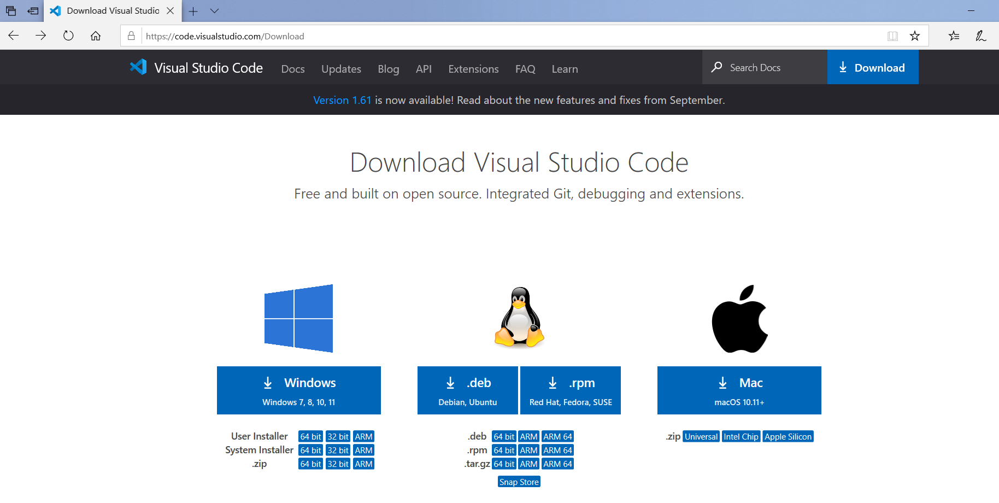
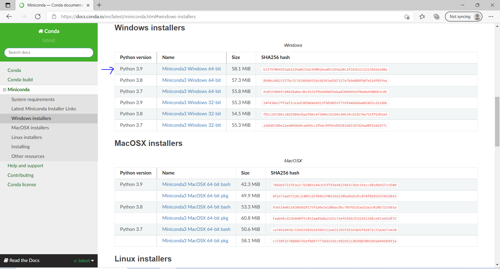
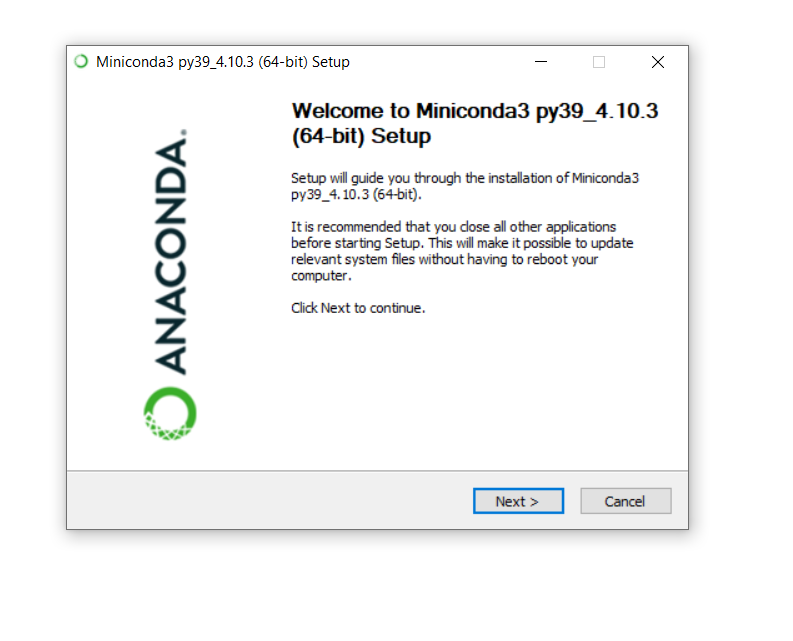
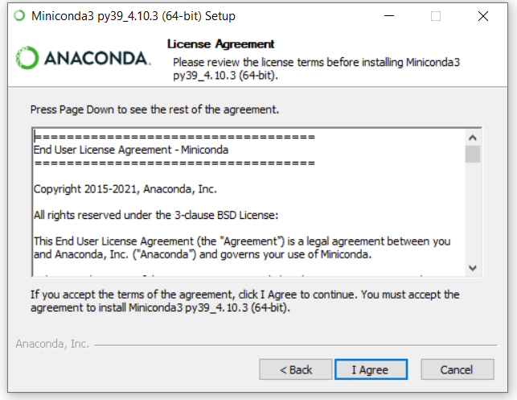
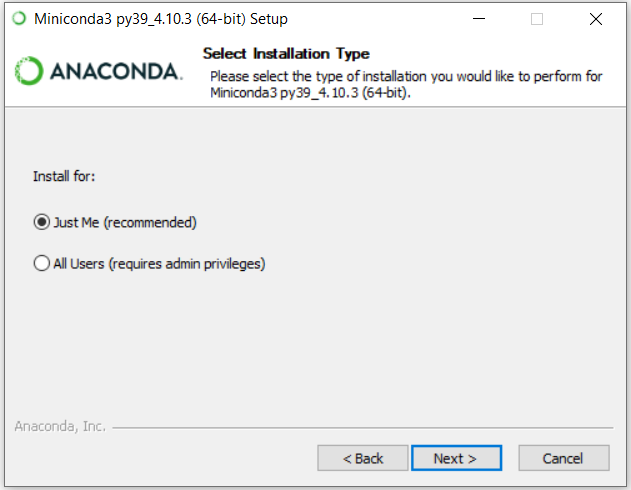
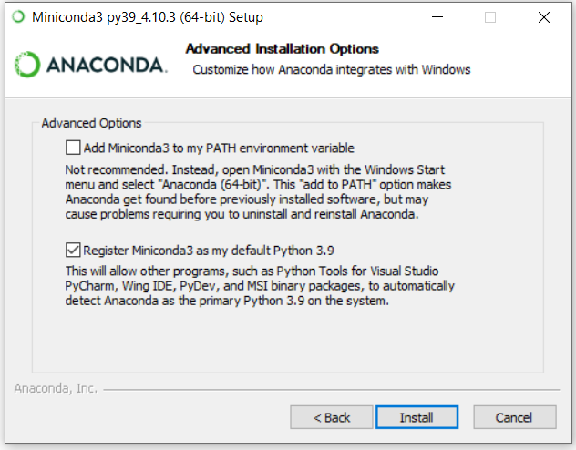
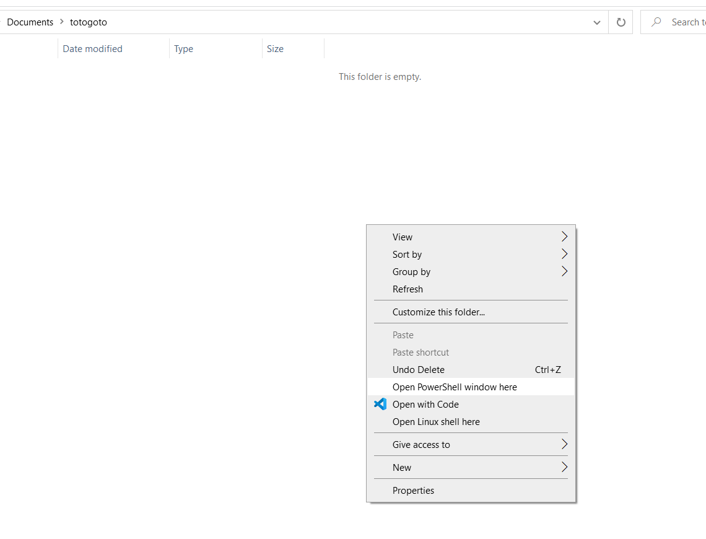
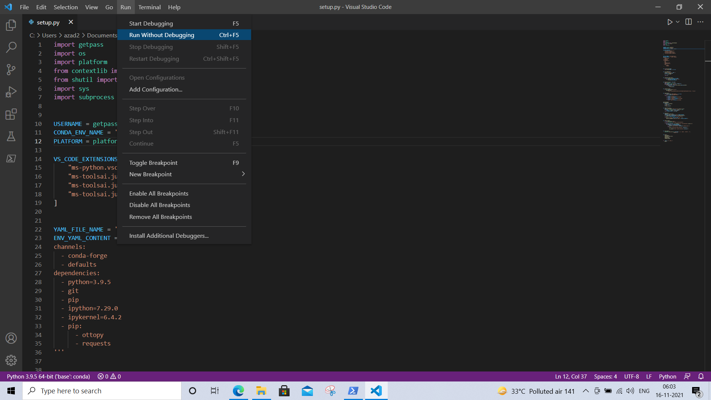
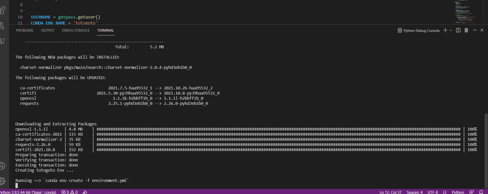
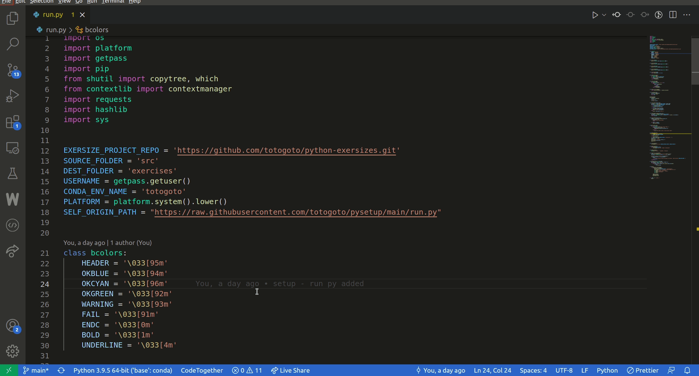

# Project Title

## Table of Contents
+ [Getting Started](#getting_started)
    + [Installing VS Code](#vs-code)
    + [Installing Miniconda](#miniconda)
        + [In Windows](#miniconda-windows)
        + [In Linux](#miniconda-linux)
        + [In Mac](#miniconda-mac)

    + [Settting Up the environment](#setup)
    + [Downloading & Running Project](#project-setup)
## Getting Started <a name="getting_started"></a>
These instructions will help you to setup the project up and running on your local machine.
### Prerequisites

What things you need to install the software and how to install them.

```
- Visual Studio Code
- Miniconda
```

---------

### Installing VS Code  <a name = "vs-code"></a>

 [Download Visual Studio Code](https://code.visualstudio.com/Download)


---------
### Installing Miniconda <a name = "miniconda"></a>

#### In Windows <a name = "miniconda-windows"></a>

1. [Download the installer](https://repo.anaconda.com/miniconda/Miniconda3-latest-Windows-x86_64.exe)



2. Double-click the `.exe` file
3. Click Next.

4. Read the licensing terms and click “I Agree”.

5. Select an install for “Just Me”  and click Next.


6. Click Install



#### In Linux <a name = "miniconda-linux"></a>
1. [Download the installer](https://repo.anaconda.com/miniconda/Miniconda3-latest-Linux-x86_64.sh)

2. RUN
```bash
bash Miniconda3-latest-Linux-x86_64.sh
```
or 

```bash
chmod +x Miniconda3-latest-Linux-x86_64.sh
./Miniconda3-latest-Linux-x86_64.sh
```

#### In Mac OS <a name="miniconda-mac"></a>
1. [Download the installer](https://repo.anaconda.com/miniconda/Miniconda3-latest-MacOSX-x86_64.pkg)

2. Double-click the downloaded file and click continue to start the installation.

3. Answer the prompts on the Introduction, Read Me, and License screens.

4. Click the Install button to install Miniconda


---------


### Environment Setup <a name = "setup"></a>

1. create folder `workspace/totogoto` 
    #### Using VS Code

    - Open Folder in *vs code*

    - save [setup.py](https://raw.githubusercontent.com/totogoto/pysetup/main/setup.py)

    #### Using Powershell (In Windows)
    - Open the togoto folder in explorer
    - Press `Shift + Right Click` and click `Open powershell window here`

    
        
    - Run these Commands
    ```powershell
    $uri="https://raw.githubusercontent.com/totogoto/pysetup/main/setup.py"

    Invoke-WebRequest -Uri $uri -OutFile setup.py

    ```

    #### Using Bash
    - Open termial
    - cd `workspace/totogoto`
    - Run

    ```bash
    #using wget
    wget https://raw.githubusercontent.com/totogoto/pysetup/main/setup.py

    # using curl
    curl https://raw.githubusercontent.com/totogoto/pysetup/main/setup.py -o setup.py
    ```


2. Running `setup.py`
    - open totogoto folder in `vscode`
    - select `setup.py`
    - change the interpreter to `base:conda`
    - select `Run > Run without debugging`
 

 - Wait for setup to complete
 

 ---------

 ### Project Setup and Running <a name = "project-setup"></a>
 1. Close the `VS Code` and reopen again.
 2. open `run.py` file
 3. change interpreter to `togotogo`


 4. select `Run > Run without debugging`
 5. Then Enter Project No to download 
